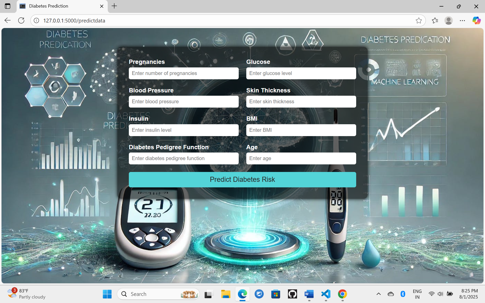
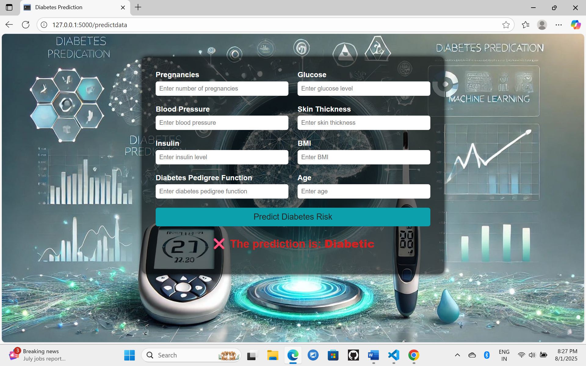
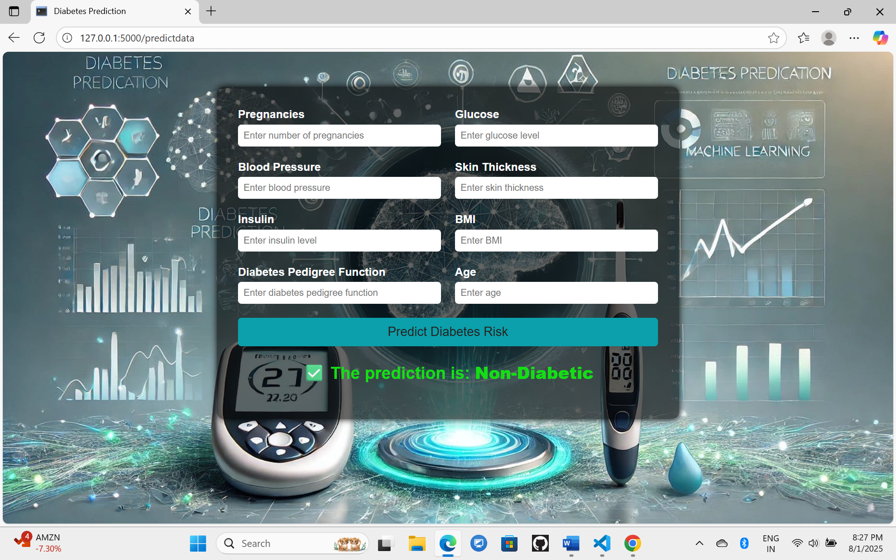

# 🩺 Diabetes Detector

A machine learning web application that predicts the likelihood of diabetes in a person based on key medical indicators.

## 🔍 Project Overview

This project uses various ML algorithms to predict whether a person is diabetic or not based on features like BMI, Glucose, Blood Pressure, Insulin, and more. It includes data preprocessing, feature engineering, model training, evaluation, and deployment via a Flask web interface.

## 🖼️ Screenshots

### 🏠 Home Page
 <!-- Replace with your actual image path -->

### 📊 Prediction Result




---

## 🧠 Machine Learning Models Used

- Logistic Regression
- Decision Tree
- Random Forest
- XGBoost
- CatBoost
- Gradient Boosting
- K-Nearest Neighbors (KNN)
- AdaBoost

> **Best model selected based on Accuracy.**

---

## 🧪 Dataset

- **Source:** PIMA Indians Diabetes Dataset
- **Shape:** (768, 9)
- **Features:**
  - Pregnancies
  - Glucose
  - BloodPressure
  - SkinThickness
  - Insulin
  - BMI
  - DiabetesPedigreeFunction
  - Age
  - Outcome (Target)

---

## ⚙️ Features

- PowerTransformer (Yeo-Johnson)
- Outlier detection using IQR
- QQ Plot visualization
- SMOTE for class balancing
- Hyperparameter tuning with GridSearchCV
- Model evaluation & comparison
- Flask-based web app for user input & prediction

---

## 💻 Tech Stack

| Category | Tools |
|----------|-------|
| Language | Python |
| ML/DS Libraries | Scikit-learn, Pandas, NumPy, Matplotlib, Seaborn, XGBoost, CatBoost, SMOTE |
| Web | Flask, HTML, CSS |
| Deployment | (optional) Heroku, GitHub Pages, or Render |

---

## 🖥️ How to Run the Project Locally

1. **Clone the repository**
   ```bash
   git clone https://github.com/seelamdivya23/Diabetes-Detector.git
   cd Diabetes-Detector
  
2.**Create a virtual environment**
```
python -m venv venv
source venv/bin/activate      # On Windows: venv\Scripts\activate
```
3.Install dependencies
```
pip install -r requirements.txt
```
4.Run the app
```
python app.py
```
📁 Project Structure
```
Diabetes-Detector/
│
├── static/
 ├── screenshot/ screenshot.png                     # CSS, JS, or other static files, 📸 Add screenshots 
├── templates/                   # HTML templates
├── src/                         # Python modules for ML pipeline
├── notebook/                    # Jupyter Notebooks for EDA, training, etc.
├── media/              
├── app.py                       # Flask app
├── requirements.txt             # Python dependencies
├── README.md                    # 📝 Main project description
├── .gitignore

```
# 📊 Results
 ## Best Accuracy: ~80% for Adaboost

 # 🙋‍♀️ Author
 Divya Seelam <br>
📧 Email: divyaseelam83@gmail.com
# 🌟 Acknowledgements
🔗 PIMA Diabetes Dataset – Kaggle
👉 https://www.kaggle.com/datasets/uciml/pima-indians-diabetes-database

Scikit-learn & Flask Documentation
## ⭐️ Don't forget to star the repo if you find it useful!

   

